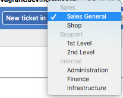

# RT Queue Categories

RequestTracker extension to group queues by categories:

## Quickstart

Install:

    # perl Makefile.PL
    # make install

Changes in RT configuration file:

    Plugin('RTx::QueueCategories');

## Configuration

1. Create a custom field "QueueCategory" of type "Select one value"
2. Add the desired categories as values
3. Apply it to all queues (globally)
4. Edit each queue to be categorized and set QueueCategory as desired

### Custom order

Categories are sorted by the sort order of the custom field's values.
Queues are sorted by their own sort order.
Both of them fall back to alphabetical order.

### Custom field customization

The custom field's name isn't limited to "QueueCategories".
An alternative name can be configured in RT configuration file:

    Plugin('RTx::QueueCategories');
    Set($QueCat_CF, 'QueGrp');
