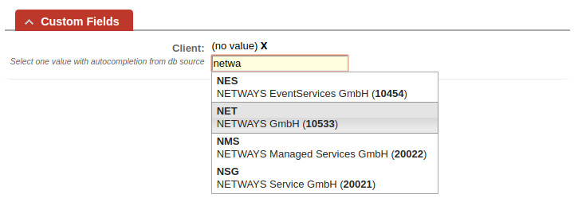
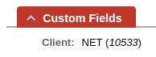

# DBCustomField Extension for Request Tracker

#### Table of Contents

1. [About](#about)
2. [License](#license)
3. [Support](#support)
4. [Requirements](#requirements)
5. [Installation](#installation)
6. [Configuration](#configuration)

## About

This extension allows to link custom field values to external databases.

Specific custom field types provided by this extension allow users to choose from a list of suggestions what they want
to associate with a ticket. This works with the help of auto-completion which is invoked once a user typed two or more
characters.



Stored and displayed is by default what the user chose. However, by configuring custom templates it is possible to
change what is displayed to the user. This applies to the list of suggestions as well as to the actual value users
will see when viewing the ticket.



Pleaes note that what is displayed to the user is not necessarily what is internally stored by RT for the custom field.
Any time a ticket is viewed by a user the extension fetches what to display from the external database. This way it is
possible to e.g. only store a primary key value and display just an associated name to users.

## License

This project is licensed under the terms of the GNU General Public License Version 2.

This software is Copyright (c) 2018 by NETWAYS GmbH <[support@netways.de](mailto:support@netways.de)>.

## Support

For bugs and feature requests please head over to our [issue tracker](https://github.com/NETWAYS/rt-extension-dbcustomfield/issues).
You may also send us an email to [support@netways.de](mailto:support@netways.de) for general questions or to get technical support.

## Requirements

- RT 4.4.2
- DBI (>= 1.37)

As well as an appropriate driver for the databases you want to integrate. (e.g. `DBD::mysql` for MySQL)

## Installation

Extract this extension to a temporary location

Git clone:

```
cd /usr/local/src
git clone https://github.com/NETWAYS/rt-extension-dbcustomfield
```

Tarball download (latest [release](https://github.com/NETWAYS/rt-extension-dbcustomfield/releases/latest)):

```
cd /usr/local/src
wget https://github.com/NETWAYS/rt-extension-dbcustomfield/archive/v1.1.0.zip
unzip v1.1.0.zip
```

Navigate into the source directory and install the extension.

```
perl Makefile.PL
make
make install
```

Clear your mason cache.

```
rm -rf /opt/rt4/var/mason_data/obj
```

Restart your web server.

```
systemctl restart httpd

systemctl restart apache2
```

## Configuration

Edit your `/opt/rt4/etc/RT_SiteConfig.pm` configuration and include the extension.

```
Plugin('RT::Extension::DBCustomField');
```

### Connections

First you need to define `$DBCustomField_Connections` which is a hash of available database connections.

```perl
Set($DBCustomField_Connections, {
    'sugarcrm' => {
        'dsn' => 'DBI:mysql:database=SUGARCRMDB;host=MYHOST;port=3306;mysql_enable_utf8=1',
        'username' => 'USER',
        'password' => 'PASS'
    }
});
```

### Queries

Then it is required to define `$DBCustomField_Queries` which is a hash of available query definitions.
Every query definition has a name and consists of two queries. One for the auto-completion suggestions
and one to fetch display values with.

```perl
Set ($DBCustomField_Queries, {
    'companies' => {
        # The connection to use
        'connection' => 'sugarcrm',

        # The query to fetch auto-completion suggestions with. `field_value' is mandatory
        # and any occurrence of `?' is replaced with a user's input.
        'suggestions' => q{
            SELECT
            cstm.net_global_id_c AS field_value, cstm.shortname_c AS shortname, a.name
            FROM accounts a
            INNER JOIN accounts_cstm cstm ON cstm.id_c = a.id AND cstm.net_global_id_c
            WHERE a.deleted = 0 AND (cstm.net_global_id_c = ? OR cstm.shortname_c LIKE ? OR a.name LIKE ?)
            ORDER BY shortname
        },

        # The display template to use for each entry returned by the suggestions query. To reference specific
        # columns here encapsulate their name with curly braces. The default is just `{field_value}'
        # HTML support: Yes
        'suggestions_tpl' => q{
            <div>
                <strong>{shortname}</strong>
                <div>{name} (<strong>{field_value}</strong>)</div>
            </div>
        },

        # The query to fetch display values with. `field_value' is only required when not defining
        # a custom display template. A single occurrence of `?' is replaced with the value internally
        # stored by RT.
        'display_value' => q{
            SELECT
            cstm.net_global_id_c AS field_value, cstm.shortname_c AS shortname
            FROM accounts a
            INNER JOIN accounts_cstm cstm ON cstm.id_c = a.id AND cstm.net_global_id_c
            WHERE cstm.net_global_id_c = ?
        },

        # The display template to use when showing the custom field value to users. To reference specific
        # columns here encapsulate their name with curly braces. The default is just `{field_value}'.
        # HTML support: Yes, but try to avoid manipulating the layout too much (e.g. with block elements)
        'display_value_tpl' => '{shortname} (<i>{field_value}</i>)'
    },
});
```

### Create Custom Fields

Create a new custom field and choose the following type:

- Select one value with autocompletion from db source

### Custom Fields Map

Last you need to define `$DBCustomField_Fields` which maps query definitions to specific custom fields.
This controls which suggestions a user receives when typing something into a custom field input.
Note that these custom fields need to be of the type provided by this extension.

```perl
Set($DBCustomField_Fields, {
    'Client' => 'companies'
});
```

### Suggestion Limit

By default the limit of suggestions displayed to the user is 10. To adjust this you can use the following:

```perl
Set($DBCustomField_Suggestion_Limit, 25);
```

#### Advanced Configuration

##### `__TICKET__`

Can be used as part of any query to reference a ticket's ID. (Is replaced by this extension with an integer.)

##### `__VALUE__`

Can be used only as part of the `display_value` query to reference the `field_value`. (Is replaced by this
extension with whatever has been stored internally by RT.)
