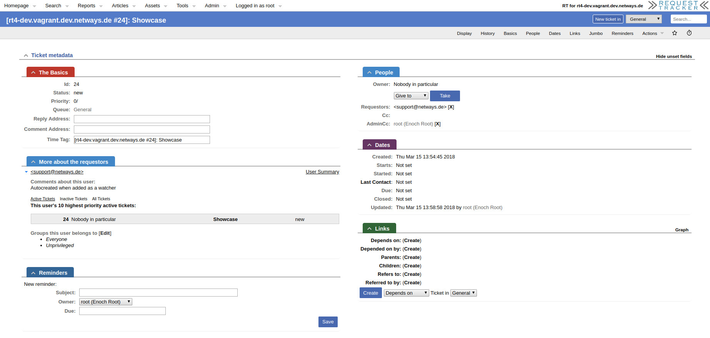
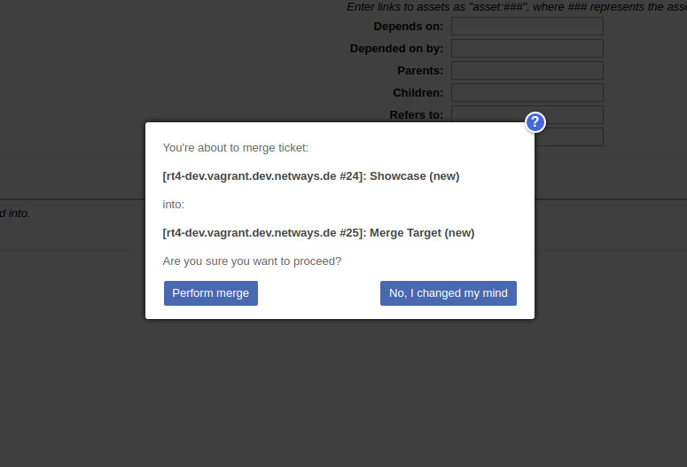

# RT-Extension-Netways

#### Table of Contents

1. [About](#about)
2. [License](#license)
3. [Support](#support)
4. [Requirements](#requirements)
5. [Installation](#installation)
6. [Configuration](#configuration)

## About

Some special features for the NETWAYS GmbH.

https://www.netways.de

These features are the following:

* Custom header for tickets \[Configurable\]
* Register ticket authors as AdminCc instead of Requestor \[Configurable\]
* Read-Only boxes under a ticket's basics to quickly copy and share details
* Quick removal of poeple registered as AdminCc or Requestor
* Quick assign of people as AdminCc or Owner \[Configurable\]
* Switched positions of ticket people and reminders
* Safety measures when merging tickets (aka A modal confirmation dialog)
* Empty search result boxes are automatically hidden (e.g. on "RT at a glance") \[Configurable\]
* Additional CSS classes for search result boxes (e.g. on "RT at a glance")
    - netways-tickets-default (If no other of the following applies)
    - netways-tickets-request
    - netways-tickets-watched
    - netways-tickets-nobody
    - netways-tickets-due

## License

This project is licensed under the terms of the GNU General Public License Version 2.

This software is Copyright (c) 2018 by NETWAYS GmbH [support@netways.de](mailto:support@netways.de).

## Support

For bugs and feature requests please head over to our [issue tracker](https://git.netways.org/rt4/rt-extension-netways/issues).
You may also send us an email to [support@netways.de](mailto:support@netways.de) for general questions or to get technical support.

## Requirements

- RT 4.4.2

## Installation

Extract this extension to a temporary location.

Git clone:

    cd /usr/local/src
    git clone https://git.netways.org/rt4/rt-extension-netways

Tarball download:

    cd /usr/local/src
    wget https://git.netways.org/rt4/rt-extension-netways/repository/master/archive.tar.gz
    tar xzf archive.tar.gz

Navigate into the source directory and install the extension. (May need root permissions.)

    perl Makefile.PL
    make
    make install

Edit your `/opt/rt4/etc/RT_SiteConfig.pm`

Add this line:

    Plugin('RT::Extension::Netways');

Clear your mason cache:

    rm -rf /opt/rt4/var/mason_data/obj

Restart your webserver.

## Configuration

**$Netways_EnableTagFormat**

If enabled, applies the custom header for tickets.

**$Netways_UserRequestorGroup**

The group of which authors must be a member to get registered as AdminCc instead of Requestor.

**$Netways_EnableQuickAssign**

If enabled, shows the form controls to quickly assign people as AdminCc or Owner.

**$Netways_QuickAssignGroup**

Which group's members should be choosable when showing the quick assign form controls.

**$Netways_ShowSearchOnlyWithResults**

If enabled, hides empty search result boxes automatically. (e.g. on "RT at a glance")

### Example

    # Enables everything provided by RT::Extension::Netways
    Set($Netways_EnableTagFormat, 1);
    Set($Netways_UserRequestorGroup, 'NETWAYS');
    Set($Netways_EnableQuickAssign, 1);
    Set($Netways_QuickAssignGroup, 'NETWAYS');
    Set($Netways_ShowSearchOnlyWithResults, 1);
