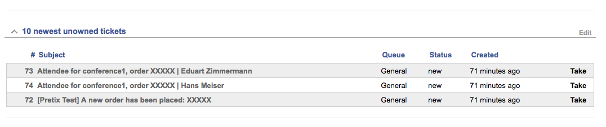
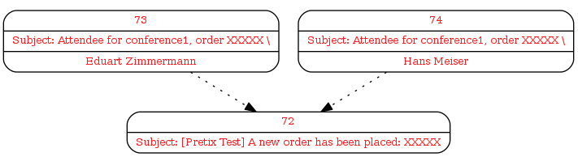
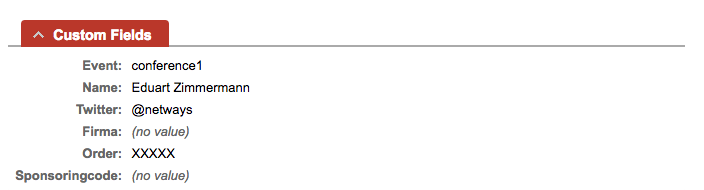
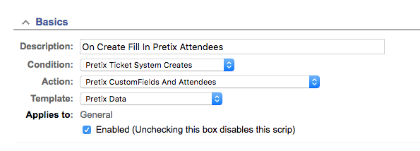
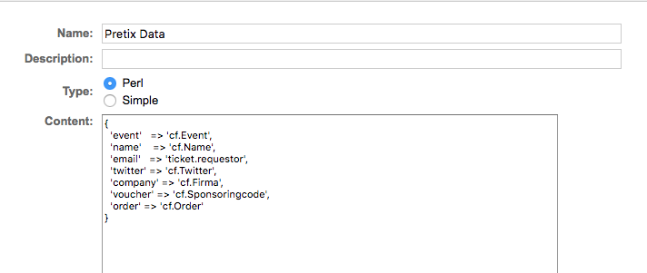

# MySQL Query Hint Extension for RequestTracker

#### Table of Contents

1. [About](#about)
2. [License](#license)
3. [Support](#support)
4. [Requirements](#requirements)
5. [Installation](#installation)
6. [Configuration](#configuration)

## About

[Pretix](https://pretix.eu/) is a open source ticketing system (e.g. sell tickets for conferences).


The plugin tests new tickets if they contain pretix order codes. If so, it does the following:

 * Fetch data from the pretix api (order, attendees and voucher)
 * Add data to customfields
 * Set requestor mail based on attendee

If a order contains more that one attendee, we create tickets for every attendee and link the new tickets
to the order.







## License

This project is licensed under the terms of the GNU General Public License Version 2.

This software is Copyright (c) 2018 by NETWAYS GmbH <[support@netways.de](mailto:support@netways.de)>.

## Support

For bugs and feature requests please head over to our [issue tracker](https://github.com/NETWAYS/rt-extension-pretixapi/issues).
You may also send us an email to [support@netways.de](mailto:support@netways.de) for general questions or to get technical support.

## Requirements

- RT 4.4.2

## Installation

Extract this extension to a temporary location.

Navigate into the source directory and install the extension.

```
perl Makefile.PL
make
make install
make initdb
```

Clear your mason cache.

```
rm -rf /opt/rt4/var/mason_data/obj
```

Restart your web server.

```
systemctl restart httpd

systemctl restart apache2
```

## Configuration

Beside the ```RT_SiteConfig.pm``` you need a scrip and a template which configures the custom fields to be filled 
on ticket creation.

### Scrip Configuration



### Template

We pull the following data out of a order mail:

```
company
street
city
zip
email
country
name
order
event
twitter
voucher
```

This field names can be used in a template to fill ticket fields:

```perl
{
  'event'   => 'cf.Event',
  'name'    => 'cf.Name',
  'email'   => 'ticket.requestor',
  'twitter' => 'cf.Twitter',
  'company' => 'cf.Firma',
  'voucher' => 'cf.Sponsoringcode',
  'order' => 'cf.Order'
}
```

The prefix ```cf``` means custom fields by name or id, ```ticket``` means direct ticket attributes. Only
```requestor``` is implemented at the moment.


    

### Mandatory

**$PretixApi_Base_URI**

Base URI to the pretix api, with version entry point, e.g.

```https://tickets.foo.bar/api/v1```

**$PretixApi_Auth_Token**

Auth token for API access.

**$PretixSender_Regexp**

E-mail-address of the pretix system. This is needed to identify mail from the pretix system.

### Optional

**$Pretix_User_Agent**

HTTP user agent to backtrace in logs. Defaults to rt name and pretix api version:

```rt4test/0.9.0```

**$PretixAttendee_Subject_Format**

How subject for child tickets are generated. Defaults to:

```'Attendee for {$event}, order {$order} | {$name}'```

The string format is perl's [Text::Template](https://metacpan.org/pod/Text::Template) and 
use the [template](#template) fields.

**$PretixTop_Subject_Format**

How the subject of the top ticket is rewritten. Defaults to:

```'Order has been placed {$order} for {$event} | {$name}';```


The string format is perl's [Text::Template](https://metacpan.org/pod/Text::Template) and 
use the [template](#template) fields.

**$Pretix_Twitter_QuestionId**

The id of the custom question used for twitter handle. Defaults to ```75```.

### Example

```perl
Plugin('RT::Extension::PretixApi');

Set($PretixApi_Auth_Token, 'XXX');
Set($PretixApi_Base_URI, 'https://tickets.foo.bar/api/v1');
Set($PretixSender_Regexp, qr{^tickets\@foo\.bar$});
```

### Technical note

The plugin uses [Cache::FileCache](https://metacpan.org/pod/Cache::FileCache) to cache api requests (orders, vouchers)
which expires after one hour. To purge the cache you can remove the caching directory:

```
rm -rf /tmp/FileCache/pretix/
```
